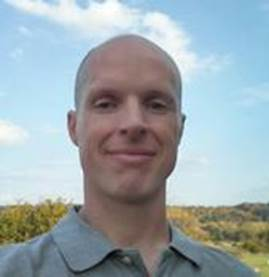

---
#
# By default, content added below the "---" mark will appear in the home page
# between the top bar and the list of recent posts.
# To change the home page layout, edit the _layouts/home.html file.
# See: https://jekyllrb.com/docs/themes/#overriding-theme-defaults
#
layout: home
---

|  | **Roscoe A. Bartlett, Ph.D.** Computational Software Engineer and Researcher ***Employer:*** [Sandia National Laboratories](https://www.sandia.gov/) ***Work website:***: [www.cs.sandia.gov/cr-rabartl](http://www.cs.sandia.gov/cr-rabartl) ***Personal Website:*** [bartlettroscoe.github.io](https://bartlettroscoe.github.io) ***Work Email:*** [rabartl@sandia.gov](mailto:rabartl@sandia.gov) ***Phone***: 1-240-600-4172 |

[comment]: <> (NOTE: the above single line for the figure and the side text is necessary for the formatting to work.  Any newline breaks this.)

Roscoe provides leadership, technical expertise, knowledge, and experience in
applying and researching the application of modern software engineering
methods to computational science and engineering (CSE) problems for a variety
of large, complex CSE projects. This work leverages his background in chemical
engineering, applied math, large-scale nonlinear programming, software
development, software integration, software engineering best-practices, and
over 20 years of doing numerical algorithm and software development and
software engineering on large and small computational science and engineering
projects. Roscoe's more recent interests focus on software engineering
processes and workflows for creating individual packages of sustainable
software and sustainable ecosystems of packages shared among large distributed
teams of developers.

[Resume/CV](cv) provides a summary of Roscoe's education and work experience
and a link to his [detailed CV](cv/bartlett_roscoe_a_cv.pdf).  Also see the
listing of his [professional interests](interests) and a list of selected
[publications and presentations](publications).  Finally, an annotated
[reading list](reading-list) is provided for Roscoe's recommendations for
several great books on software engineering and C++ programming.  (These books
and the application of the principles and practices described therein provided
a majority of Roscoe's self-taught education on C++ programming and software
engineering.)
